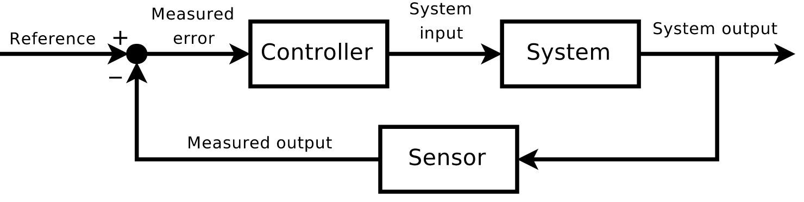
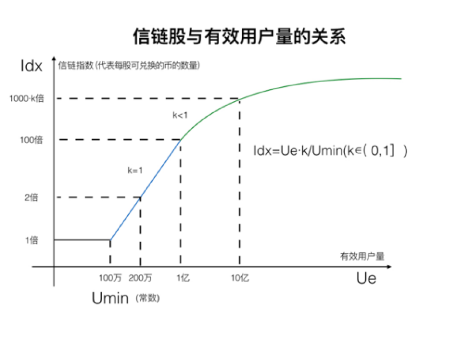

## 3.2	信链的经济模型



图 14 负反馈系统


从控制论的角度来看信链的经济模型，可以发现信链的经济模型是一个负反馈系统，负反馈系统的一个最重要的特性就是其是趋于稳定的，而比特币的经济模型则是一个正反馈系统，也就是说是无法稳定运行的。

信链币将会通过ICO的方式发行，信链币与比特币在产品特性上的最主要差别就是信链币的总量是根据当前用户数来确定的，而比特币的总量是固定的。

信链币的ICO中，股东通过某种被广为接受的硬通货比如（比特币、ETC、或人民币、美金）换取信链股，我们将会设定一个最低的目标用户数$$U_{min}$$（常数，比如100万用户），那么可兑换的信链币的总数$$B$$计算公式如下：

$$
B = I_{dx} * S
$$

其中$$I_{dx}$$称为信链指数，代表单位信链股可以兑换的币的数量，其计算公式为:

如果$$U_e \leqslant 100$$万，则:

$$
I_{dx} = 1
$$

如果$$U_e \gt 100$$万，则：

$$
I_{dx} = \frac{U_{e} * k}{U_{min}},  k \in \left(0, 1\right]
$$

* 其中$$U_{e}$$代表当前信链平台的有效用户总数;
* 其中$$S$$代表信链股的总数;
* 我们将$$I_{dx}$$称为信链指数，代币单位信链股可以兑换的币的数量;
* $$B$$为可兑换的信链币的总数;
* $$I_{dx}$$称为信链指数;



图 15 信链股与有效用户量的关系


所以说，从经济模型的角度来说，信链与比特币、以太坊等绝大多数加密币的区别就是：**信链币的人均发行总量有限，而比特币是绝对总量有限**。绝对总量有限的加密币系统已经被无数多的实例证明，其只会导致代币价格不断的上涨，系统通缩，这导致这些加密币只会被当做收藏品，而无法被用在日常生活当中。

