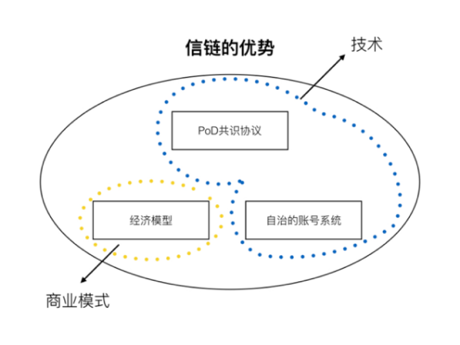

# 3	信链的技术和产品
信链相比于比特币、以太坊的最大优势在于以下三点，分别是：
1.	创新的PoD共识算法，比特币的共识算法本质上是对用户贡献的算力进行激励，而我们的共识算法是对用户贡献的存储和带宽进行激励。
2.	独特的经济模型：价格波动没有那么巨大的系统，内建的激励机制可以很好的激励股东自愿自发的贡献自己更多的资源促进整个生态的发展。
3.	自治的账号系统可以让普通用户自己控制自己的身份、数据，无需依赖任何第三方机构。



图 6 信链的优势


