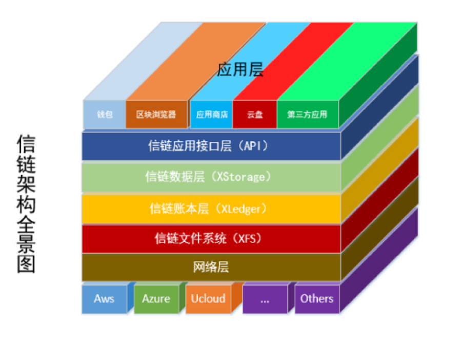
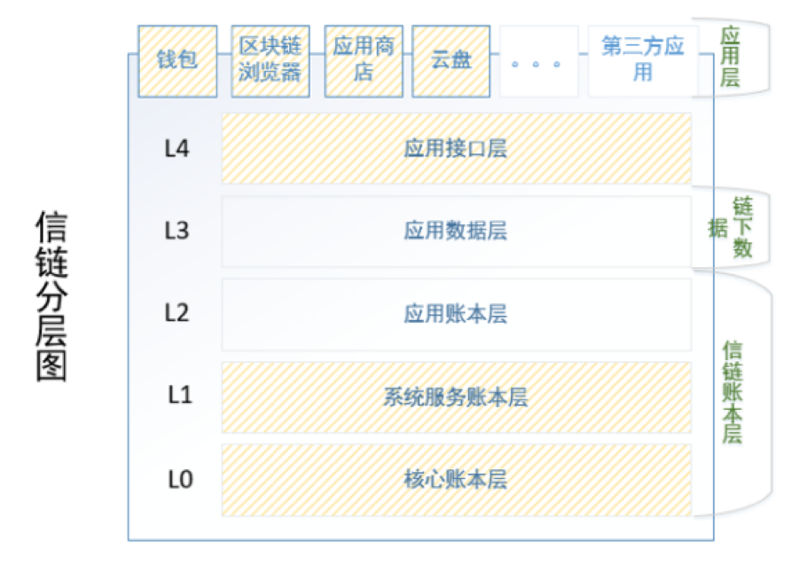
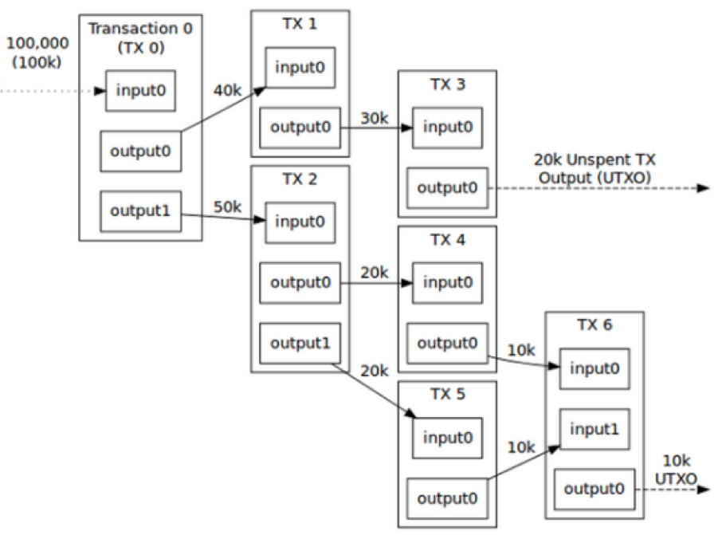
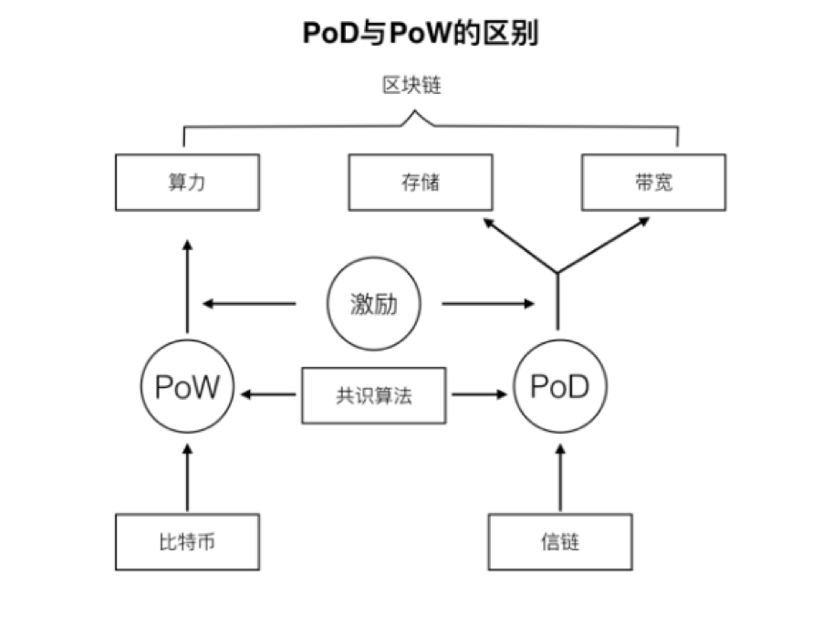
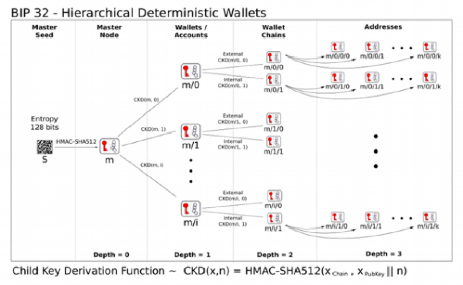
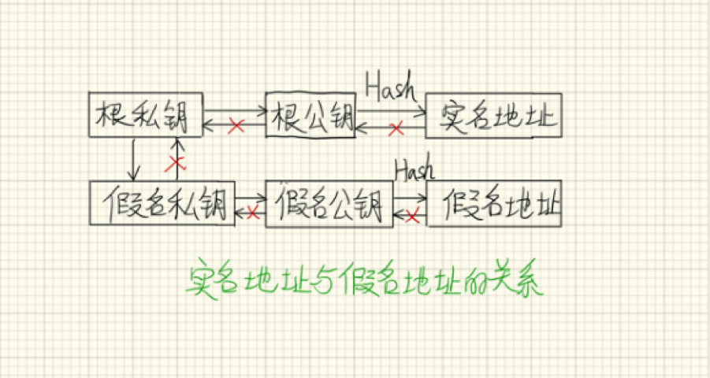
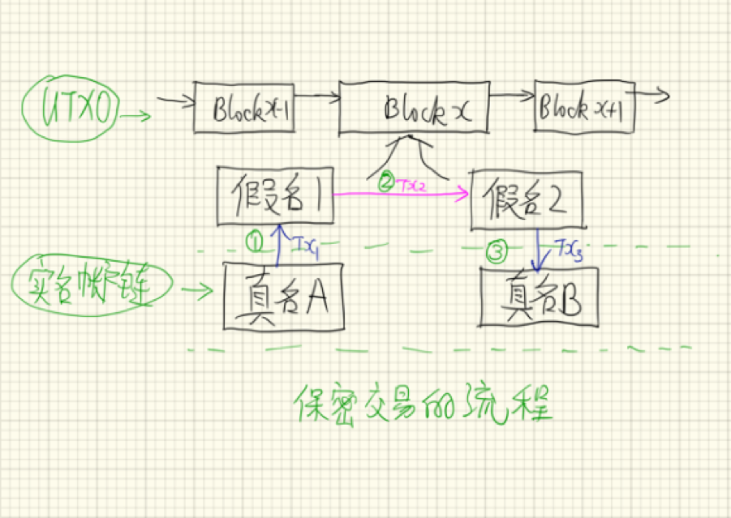
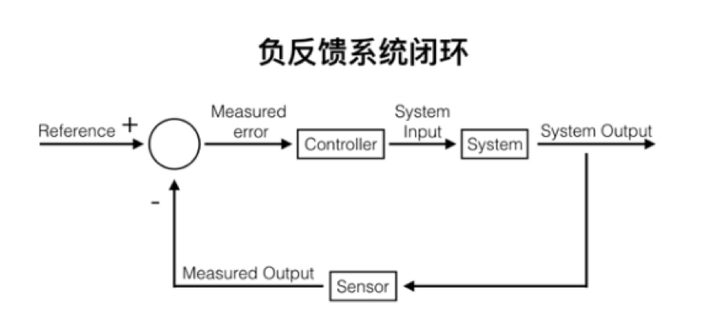
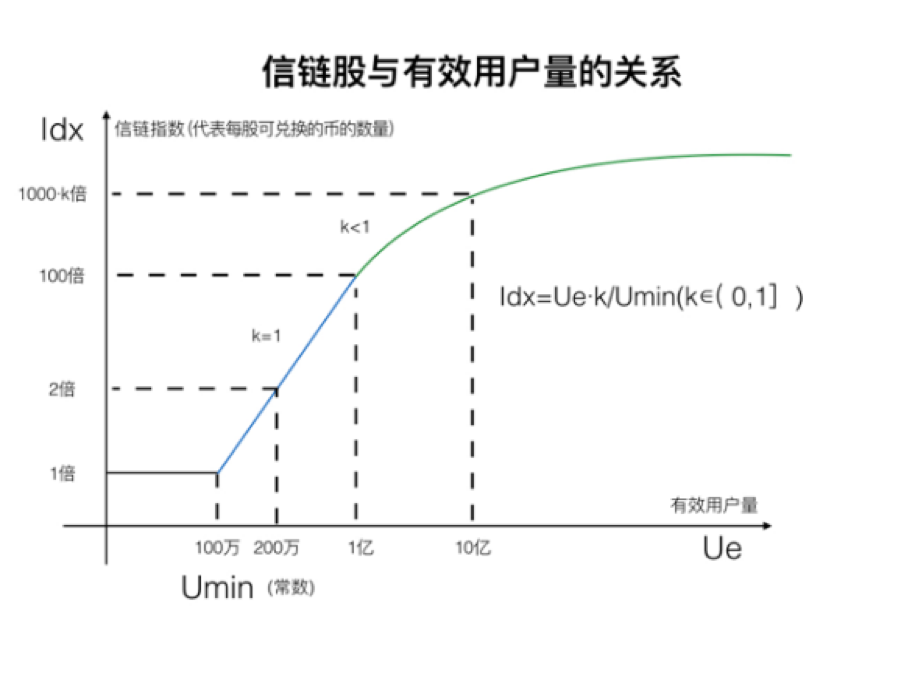
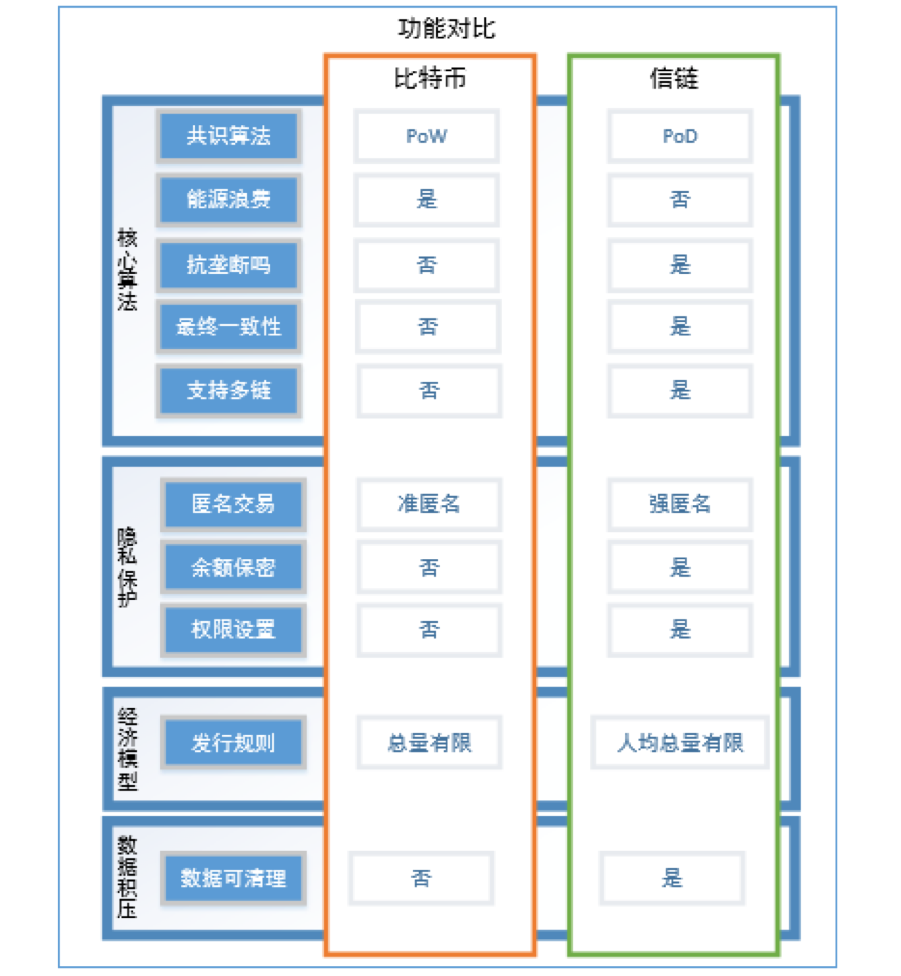

# 3	信链的技术和产品
信链相比于比特币、以太坊的最大优势在于以下三点，分别是：
1.	创新的PoD共识算法，比特币的共识算法本质上是对用户贡献的算力进行激励，而我们的共识算法是对用户贡献的存储和带宽进行激励。
2.	独特的经济模型：价格波动没有那么巨大的系统，内建的激励机制可以很好的激励股东自愿自发的贡献自己更多的资源促进整个生态的发展。
3.	自治的账号系统可以让普通用户自己控制自己的身份、数据，无需依赖任何第三方机构。



图 6 信链的优势


## 3.1	信链的技术
### 3.1.1	信链的架构
信链的网络节点可以是用户家里的个人电脑，可以是Aws、Azure、UCloud、阿里云等任何云计算服务提供商的主机，只需要安装信链的客户端，连上网络，就可以通过信链网络连接彼此，形成一个p2p网络。下图是信链的整体架构图：



图 7 信链架构全景


信链采用的是多链的架构，由一条核心链和多条侧链组成，下图中L0和L1层是完成系统主要功能的功能层。



图 8 信链架构分层图


信链的核心帐本层，也就是L0层，采用源自比特币的UTXO结构来对交易进行组织、记录，账本上的所有交易公开可查，可追溯。是一条交易链，采用UTXO结构。采用UTXO结构的好处是：
1. 同一个区块上的多笔交易可以并发执行；
2. 所有历史交易都可以被很方便的回溯，方便审计、校验；



图 9 UTXO


L1层是系统服务层，包括账户管理、名称解析、权限管理、多链管理等功能。

L2层是上层应用配套的侧链，通常是由第三方开发商来注册建立、维护，每个上层应用都可以申请自己的链，这些应用链的数据既可以是公开的，也可以是私有的，创建者可以通过权限来控制其他用户的查询和读写权限。

### 3.1.2	PoD共识算法

共识算法是区块链的核心算法或协议，我们有我独创的PoD（Proof Of Data）共识算法。共识算法是区块链的核心算法或协议，区块链网络从机器的角度来说，其三个物理构成要素分别是：算力、存储、带宽；PoW算法本质上是对用户贡献的算力进行经济激励，而我们的算法是对用户贡献的存储和带宽进行经济激励。比特币是第一种把共识算法与经济激励相结合的成功应用，经济激励对维护整个网络的长期安全可靠稳定的运行、对整个比特币生态圈的良性循环具有不可替代的作用，而我们的算法只从激励的角度来说与PoW算法完全不一样，是一种全新的算法或协议。



图 10 PoD与PoW的区别


我们的PoD算法无需挖矿，用户只需要存储指定的数据（通常是账本数据）并在线一段时间，就有机会获得相应的经济激励。

算力是一种线下资源，任何人只要有足够的金钱，就可以购买到足够多的算力，从而可以实现算力垄断，可以很轻易的发起51%攻击，这对整个网络的安全是一种潜在的隐患。

而存储和带宽都是线上资源，是无法垄断的，举个例子来说：假如我有1G的数据需要存储，用户A贡献了10G的空间，那我们只对其给予对应于1G空间的经济激励，多出来的9G空间是不起作用的；同理，对带宽资源也是一样的道理。这样就可以真正做到多劳多得、按需激励的效果。

### 3.1.3	公私钥及地址生成方案
信链的地址系统分为两种，实名地址和假名地址，实名地址与真实世界中用户的某个属性一一对应，如用户的邮箱地址、身份证号码、或者某个生物特征ID；每个用户有且仅有唯一的一个实名地址，但是可以有很多的匿名地址，而且用户可以随时弃用自己的某个匿名地址，所以说匿名地址相当于用户的一个假名，可以用于隐藏用户的真实身份。为了很好的保护用户的隐私性，保障用户在绝大部分情况下都不会泄露自己的实名地址。

信链的私钥、地址生成方案基本上遵循BIP 0032，也就是分层决定性钱包地址方案:

	实名地址 = DoubleHash（根公钥）
	假名地址1 = DoubleHash（子公钥1 + P），P是用户选择的一个随机字符串；
	
这样用户的每个假名地址都能够很轻易的从用户的根私钥生成，而且很容易验证，但是却无法从假名地址反推出其对应的根私钥，也就无法与实名地址进行关联。



图 11 分层确定性钱包地址方案


### 3.1.4	用户自治的账号系统

信链将会同时支持实名账号和假名账号，以匹配不同的用户需求。匿名账号的交易记录、账号余额都是公开可查的；实名账号的交易记录、账号余额是保密的，只有交易相关方可以查询。实名账号可以实现更多人性化的易用服务，比如账号密钥重置功能。 而假名账号则可以用来保护用户的交易记录、账号余额等信息不被泄露。
采用该模型，其隐私性不会低于ZCash、达世币等专注于隐私保护的特殊币种，却具有更好的用户友好性。



图 12 实名地址与假名地址的区别


### 3.1.5	信链的保密交易

因为同时支持实名账号和假名账号系统，信链得以实现高度隐私的保密交易，其流程如下：



图 13 信链保密交易的流程


上图中Tx1和Tx3都是保密的交易，Tx2是公开的交易，Tx1和Tx3的数据保存在账号链上，只有交易相关方才能查询到这些交易；Tx2的交易保存在核心的交易链上，其数据是公开可查询、可验证、可回溯的。

## 3.2	信链的经济模型



图 14 负反馈系统


从控制论的角度来看信链的经济模型，可以发现信链的经济模型是一个负反馈系统，负反馈系统的一个最重要的特性就是其是趋于稳定的，而比特币的经济模型则是一个正反馈系统，也就是说是无法稳定运行的。
信链币将会通过ICO的方式发行，信链币与比特币在产品特性上的最主要差别就是信链币的总量是根据当前用户数来确定的，而比特币的总量是固定的。
信链币的ICO中，股东通过某种被广为接受的硬通货比如（比特币、ETC、或人民币、美金）换取信链股，信链币的发行方共识互联网络科技公司将会设定一个最低的目标用户数（常数，比如100万用户），那么计算公式如下：

* 其中Ue代表当前信链平台的有效用户总数；
* 其中S代表信链股的总数；
* 我们将Ue * k／Umin 称为信链指数Idx；



图 15 信链股与有效用户量的关系


## 3.3	信链的产品
### 3.3.1	产品功能
信链与比特币的产品功能对比图可以很清楚的看出信链在产品上已经大大超越了比特币。



图 16 比特币与信链的比较


