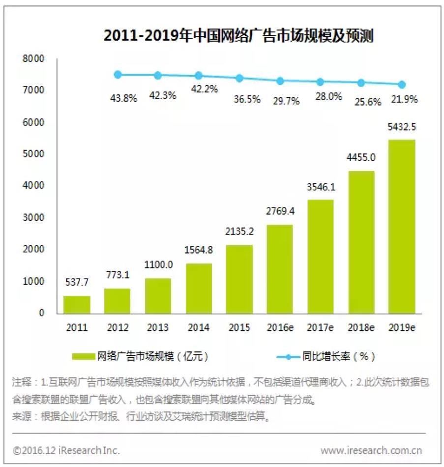

# 4	信链平台的应用场景

## 4.1	数据安全与隐私保护

**痛点**：现有的云盘无法保障个人的数据被遗忘权（或数据删除权）、数据可迁移权、数据使用知情权；
凯文凯利说过所有的生意都是数据的生意，马云说过数据就是生产资料，这些都充分说明掌握数据所有权的重要性，在数字化时代每个人都应该掌握自己生产的数据的所有权，主要包括数据被遗忘权（或数据删除权）、数据可迁移权、数据使用知情权；

**区块链解决方案**：将每个人自己生产的数据放到自己指定的空间中，只有自己能够决定何时删除、何时修改、何时交易自己的这些数据；这些数据存储空间必须不被任何大的机构所控制，但是也不限制任何愿意善意提供服务的商家提供这些存储空间。

## 4.2	知识产权保护

信链可以用于进行知识产权的保护，尤其适合数字化内容的保护，比如艺术品、音频、视频等。这里面蕴含着巨大的市场空间，因为有数据显示互联网上80%以上的流量是音视频流量，国内的视频网站就有好几十家，现有的DRM技术基本上无法很好解决各种盗版的问题，而区块链是一种很有前途的数字化内容产权保护技术。

## 4.3	会计记账

**痛点**：行业标准复式记账法过于复杂，效率低，已经几百年没有改进了。

复式记账法（Double entry bookkeeping）起源于13~14世纪的意大利。借贷记账法“借”、“贷”两字，最初是以其本来含义记账的，反映的是“债权”和“债务”的关系。复式记账法对于每一笔经济业务，都要以相等的金额在两个或两个以上相互联系的账户中进行登记，系统地反映资金运动变化结果的一种记账方法。

**区块链解决方案**：我们正在研发的基于区块链的协同单式记账法（Collaborative single entry bookkeeping）所取代，因为基于区块链的记账将可以做到更加高效和简单。这必将是一种颠覆性的创新，涉及到几乎所有的行业、企业，虽然这可能会是一个比较漫长的过程，但是趋势是不可逆的。

## 4.4	去中心化的搜索引擎

2009年全球搜索引擎市场规模达339.0亿美元，2015 年全球的搜索引擎市场规模达到 815.9 亿美元。目前，全球搜索引擎用户达18.57亿，中国搜索引擎市场用户有5.66亿，占到了全球的30%。但从收入看，中国2015年的搜索引擎收入102.36亿美元，只占到了全球的12.5%，小于GDP在全球的占比16%，中国的搜索引擎市场收入规模还存在很大空间。

但是中心化的搜索引擎带来的各种弊端显而易见，最主要的就是缺乏监管，其通常的商业变现模式是付费广告，但是广告效果通常是由搜索引擎提供商自己说了算的，这种过度中心化的商业模式一定会被不那么中心化的商业模式所替代的，我坚信只有削弱过于强势的搜索引擎提供商的中心地位才能真正更好的为客户服务。或许有人会认为增加一些竞争对手可以降低强势搜索厂商的中心化地位，可是如果不从根本上变革搜索引擎的商业模式，这只是前驱狼，后继虎，并无法从根本上改变搜索引擎厂商一家独大的状况。基于区块链技术或许有可能实现去中心化的搜索引擎。

## 4.5	互联网广告

**痛点**：互联网广告行业的造假非常严重，一方面是中心化的商业模式带来的问题，一方面是技术上没有更好的解决方案。

**区块链解决方案**：区块链技术的出现将会给互联网广告行业带来很多变化，例如一定程度的去中心化或许将带来行业商业模式的变化。

**商业前景**：互联网广告是谷歌、百度最主要的收入来源，谷歌更可以说是世界上最大的互联网广告公司。2016年，中国网络广告年度市场规模为2769亿元，同比增长率为29.7%，略有放缓。但从整体发展来看，网络广告市场仍将保持较快的增长水平，预计在2019年将超过5000亿，2016-2019年的复合增长率仍将在25%以上。



图 17 2011-2019年中国网络广告市场规模及预测


## 4.6	去中心化的评价系统

现有互联网的电子商务、新闻网站、广告系统都对用户评价、评分系统有着严重的依赖，甚至已经成为了其商业模式不可分割的一部分，俗称为“水军”的造假行为司空见惯。区块链与小微支付相结合或许将可以很好的解决其中的一部分问题，任何人要发起评论、浏览文章都必须支付一定的费用，这样将抬高造假的成本，将会遏制水军现象。同时也能给内容生产商带来更加便捷、高效的盈利途径。

## 4.7	清洁能源

**痛点**：太阳能、风能（陆上、海上）、水电等清洁能源发电成本较低，其很大一块成本是并网输送上。

区块链解决方案：信链独特的PoD算法本质上可以视为将电能转换成了对数据的存储、分享能力，如果清洁能源生产商能够就近将自己生产的电能现场转换成信链币，那就可以节省大量的并网输送成本，而且其不受电网高低峰值的价格波动，可以常年不间断的获取商业利润。

## 4.8	商业积分或客户忠诚系统

**痛点**：传统线下或线上商业场景中，VIP卡、积分卡等通常都可以大大提高消费者对商家的忠诚度、活跃度，但是往往不同商家发行的积分卡无法互通，导致对用户的体验非常差。

区块链解决方案：基于区块链的商业积分系统在技术上将更加容易发展成一种通用积分系统，而且区块链技术因为其数据不可篡改、去中心化、自证其信等特点，可以给相应的积分系统增加可信度。

## 4.9	游戏

**痛点**：很多游戏里面都有各种游戏币、游戏积分、道具，又或者各种抽奖等活动，这些在中心化的系统里面通常都有造假、无法取信于人的问题。

区块链解决方案：区块链技术能够很好的解决这些问题。

## 4.10	保险
保险行业通常都会有大量资金沉淀，如果高效、透明的管理这些资金，成为保险行业能否盈利、甚至是能否生存下去的关键问题，区块链技术将为保险行业提供一种更好的工具来解决这些问题。

## 4.11	企业协同
多个企业或同一企业内的不同部门之间的数据共享将会大大提高企业的整体运营效率，降低成本，例如企业财务数据的协同，协同记账，有可能完全重造整个会计、审计行业的规则，虽然这将会需要比较漫长的过程，但其趋势是不可逆的。

## 4.12	太空
信链在太空中的的一个很大的应用场景是太阳能的充分利用，因为太空中具有取之不竭的太阳能，可是因为空间站上的电能或太阳能无法远距离传输到地球上，其多余的能源只能是白白浪费，如果能够在空间站上将太阳能不断的转换成信链币，那将会创造无限的财富。 
远途太空旅行中需要的各种无人值守的空间站也会需要信链的技术实现经济上的激励，不管对人还是对机器，都会需要一个能够自行运作的无人值守的经济系统，毕竟在茫茫太空中没有人能够及时找到足够的人来维护经济秩序，只有信链技术能够做到自证其信，无需任何第三方的信用。

## 4.13	供应链管理
**痛点**:核心企业虽然是供应链中的主角，但其对供应链的掌控能力有限，当其将管理范围向上下游扩展的时候，将导致成本的急剧上升和效率的大幅下降。同时，核心企业的影响能力也有限，遇到势均力敌的供应商时，话语权也不强。

就拿供应商来说，一般优秀的企业最多能管理1-2级供应商，因为随着产业分工的不断细化，供应商的数量呈指数级增长，超过核心企业的管理能力。比如微软surface产品的供应链，一级供应商在5个以内，二级供应商就超过200个，三级供应商则多达数千个。

因此，核心企业一般都将管理下级供应商的工作交给一级供应商去做，这样的模式导致信息不对称且有延迟，核心企业无法实时掌控货物的流通，其中也有做假和被篡改的风险。更有甚者，由于关键技术和渠道被掌握，核心企业可能会受制于一级供应商，想要更换难度很大。

**区块链解决方案**:区块链能够围绕核心企业搭建一条包括制造商、供应商、分销商、零售商、物流公司、终端用户等在内的联盟链，将资金流、信息流、货物流都记录在链上不可篡改，值得一提的是，货物流上链可以结合物联网技术，简化协同工作。

这样一来，区块链就能够实时记录并共享供应链各环节的最新进展，核心企业得以穿透式地实现对供应链的掌握，及时地了解订单的生产、质量、运输等情况，将供应链透明化可视化。透明化的实时管理能够降低企业的库存成本，给企业应对突发事件的即时支持，也为审计提供了便利。

