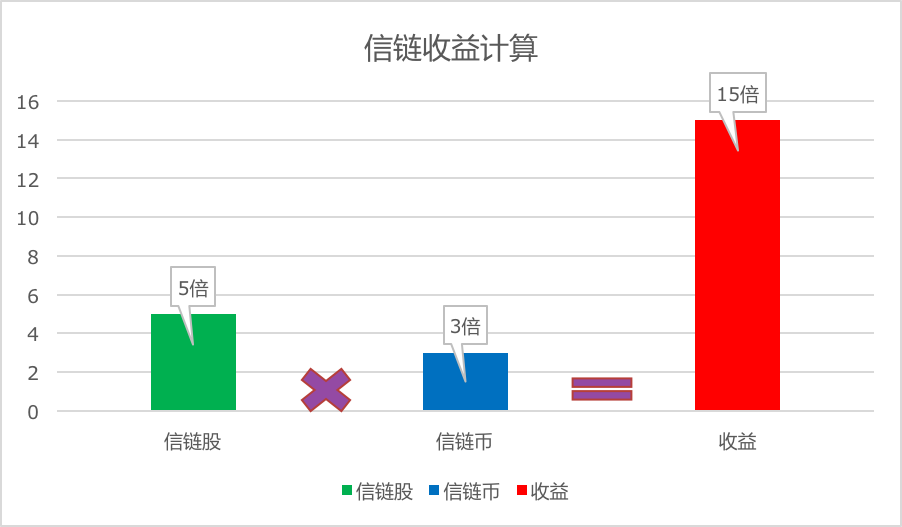

# 5	ICO发行规则
## 5.1	ICO简介
本次ICO的标的物是信链股，信链股的总量为10亿股，此次众筹出让比例占总股份的30%，也就是3亿股，剩余的信链股将在今后几年逐渐售卖出去，没有参与ICO的信链股将处于冻结状态，其对应的权益不会被分配，也不会在市场上进行销售、转让。
此次ICO信链股的分配比例如下：
* 投资人：70% * 3亿 = 2.1亿股，
* 信链团队：20% * 3亿 = 6000万股，
* 前期推广费用：10% * 3亿 = 3000万股。
我们制定的政策策略就是用良好的激励机制让股东持续贡献自己的资源，并能从中获取相应的利益，做到能者多劳，多劳多得。
我们的经济模型中最大的创新就是可以实现随着信链网络有效用户数的增长，自动给股东们进行分红，类似股票市场上的高送转，但是投资人随时可以变现这些分红。

## 5.2	ICO投资人如何获利
假设某投资人掌握的信链股可兑换的信链币的总数为B，则信链股的市场价值计算公式如下：
	V = P * B
	
-	V代表信链股的市场价值；
-	P代表信链币的单价；
-	B代表信链币的数量；

从上面的公式可以看出，持有信链股后主要有两种盈利途径：

1.	随着信链币的单价的上涨而获得总价值的上涨；
2.	随着可兑换的信链币的数量多上涨而获得总价值的上涨，也就是随着信链有效用户数的增长而增长；

以上两个因素同时起作用，而且是乘积效应；



图 18 信链收益计算


## 5.3	ICO股东额外好处

称为ICO股东并且只有称为股东，才能参与用户拉新激励计划（具体即推荐一个新用户加入信链网络，将获得一定的信链币的激励），该激励计划在早期只会对ICO股东开放，并且在后期会保持对ICO股东的政策倾斜，例如优先成为经销商或代理商等。

只有ICO股东才有可能成为信链基金会的成员，参与到信链网络的管理当中；并且可以通过为信链提供运行所需相关硬件、软件、运维服务，获得固定的信链币的回报。

## 5.4	ICO投资人收益试算
假设一个投资人最初花费1000元购买一份信链股，最初该信链股可以兑换10000个信链币，每个信链币在公开市场上可以兑换0.1元人民币，那么此时投资人持有的信链股等值是：

	1 * 10000 * 0.1 = 1000元人民币。

那么当信链网络的有效用户量达到500万的时候，则一股可以兑换20000个信链币了，而此时信链币的价格因为需求的上涨，变成0.2元人民币了，那么此时投资人持有的信链股的价值是：

	(500/100) * 10000 * 0.2 = 10000元人民，也就是涨了10倍。

## 5.5	锁定期

投资人获得的信链股都会被锁定一年时间不得进行交易，或兑换成相应的信链币，锁定期结束后，按照前面说明的规则将信链股兑换成信链币，然后可以在公开市场上对信链币进行交易流通。

