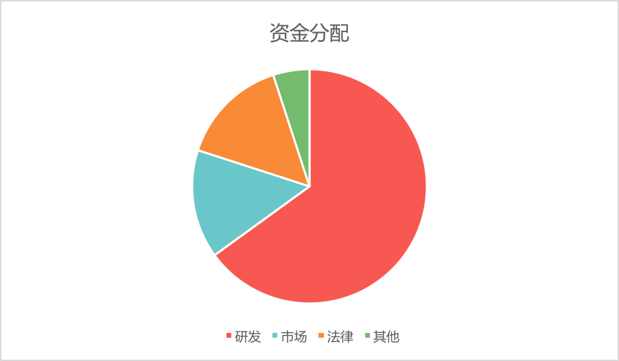

# 6	资金用途



图 6-1 预售资金的用途


## 6.1	团队扩充

计划开发人员占80%, 其他人员占20%;

计划团队扩充至20-100人, 具体人数根据业务发展进度以及融资规模来定。

## 6.2	专利申请

申请国内、国际专利

## 6.3	市场推广

搭建开发者社区、用户社区，进行市场教育，保障市场关注度

## 6.4	日常运营

主要是办公场地租赁、办公费用、软硬件等

## 6.5	风险保证金

如果预售金额超过6000万，则会设立以下风险备用基金:

*	因为涉及金钱，对安全要求极高，必须设立一个安全风险保证基金，对为信链的安全做出贡献的任何组织或个人进行激励，对因为我们自身安全原因造成的损失及时进行赔偿。

*	为了保证币价避免过大的波动，必须设立一个币价风险保证基金，采取高抛低吸的策略，维持市场信心。

